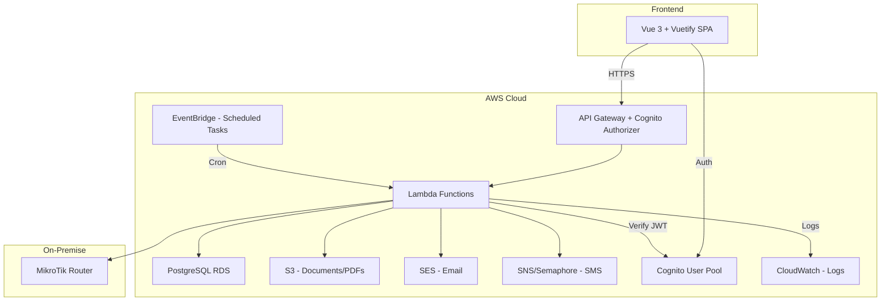
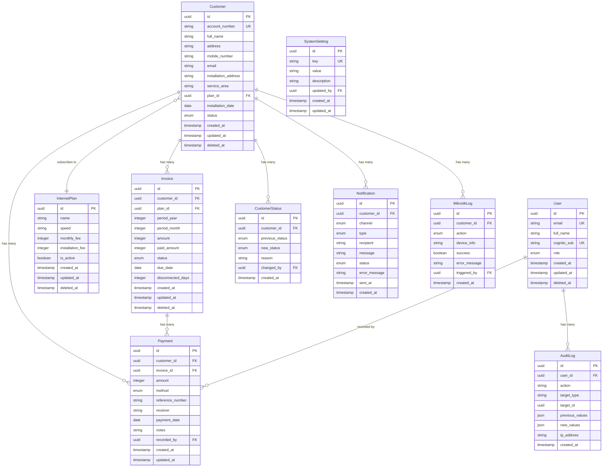

# Design Document: ISP Billing System

## Overview

The ISP Billing System is a serverless web application built with Vue 3 + Vuetify on the frontend and Node.js + TypeScript Lambda functions on the backend. It uses PostgreSQL (via Sequelize ORM) for persistence, AWS Cognito for authentication, and integrates with MikroTik RouterOS for automated network management.

The system follows a layered architecture: the frontend communicates with the backend API via REST, the backend orchestrates business logic through service classes, and scheduled EventBridge rules trigger automated processes (billing generation, overdue checks, notifications).

## Architecture



### Request Flow

1. User authenticates via Cognito (frontend SDK)
2. Frontend sends requests with Bearer token to API Gateway
3. API Gateway validates token via Cognito Authorizer
4. Lambda handler receives event, extracts user context
5. Handler calls service layer for business logic
6. Service layer interacts with Sequelize models (database)
7. Response returned through API Gateway to frontend

### Scheduled Automation Flow

1. EventBridge triggers Lambda on schedule (daily at 00:00 UTC+8)
2. Billing generation: creates invoices for customers on their billing date
3. Overdue check: marks overdue invoices, updates customer statuses
4. Auto-disconnect: disconnects customers overdue beyond threshold
5. Notification dispatch: sends reminders based on due date proximity

## Components and Interfaces

### Frontend Components

| Component | Responsibility |
|-----------|---------------|
| AuthModule | Login/logout, token management via Cognito SDK |
| CustomerModule | CRUD operations, search, filter, customer detail views |
| PlanModule | Internet plan CRUD, activation/deactivation |
| BillingModule | Invoice list, generation trigger, PDF export |
| PaymentModule | Payment recording, payment history |
| DashboardModule | Aggregated metrics, charts, recent activity |
| ReportModule | Collection reports, monthly income, overdue lists |
| SettingsModule | User management, system configuration |
| NotificationModule | Notification logs, configuration |

### Backend Service Interfaces

```typescript
// customerService.ts
interface ICustomerService {
  create(data: CreateCustomerDTO): Promise<ICustomer>;
  update(id: string, data: UpdateCustomerDTO): Promise<ICustomer>;
  archive(id: string): Promise<void>;
  restore(id: string): Promise<void>;
  findById(id: string): Promise<ICustomer | null>;
  list(filters: CustomerFilters, pagination: PaginationParams): Promise<PaginatedResult<ICustomer>>;
}

// planService.ts
interface IPlanService {
  create(data: CreatePlanDTO): Promise<IInternetPlan>;
  update(id: string, data: UpdatePlanDTO): Promise<IInternetPlan>;
  toggleStatus(id: string, active: boolean): Promise<IInternetPlan>;
  list(pagination: PaginationParams): Promise<PaginatedResult<IInternetPlan>>;
}

// billingService.ts
interface IBillingService {
  generateMonthlyInvoices(): Promise<GenerationResult>;
  calculateProratedAmount(monthlyFee: number, disconnectedDays: number): number;
  getInvoice(id: string): Promise<IInvoice | null>;
  listInvoices(filters: InvoiceFilters, pagination: PaginationParams): Promise<PaginatedResult<IInvoice>>;
  updateInvoiceStatus(id: string, status: InvoiceStatus): Promise<IInvoice>;
  exportPdf(id: string): Promise<Buffer>;
}

// paymentService.ts
interface IPaymentService {
  record(data: RecordPaymentDTO): Promise<IPayment>;
  getPayment(id: string): Promise<IPayment | null>;
  listPayments(filters: PaymentFilters, pagination: PaginationParams): Promise<PaginatedResult<IPayment>>;
}

// mikrotikService.ts
interface IMikrotikService {
  isEnabled(): Promise<boolean>;
  setEnabled(enabled: boolean): Promise<void>;
  disconnect(customerId: string, reason: string): Promise<MikrotikResult>;
  reconnect(customerId: string, reason: string): Promise<MikrotikResult>;
  syncStatus(): Promise<SyncResult>;
  getActiveSessions(): Promise<Session[]>;
}

// notificationService.ts
interface INotificationService {
  sendDueReminder(customerId: string): Promise<NotificationResult>;
  sendOverdueNotice(customerId: string): Promise<NotificationResult>;
  sendPaymentConfirmation(paymentId: string): Promise<NotificationResult>;
  sendDisconnectWarning(customerId: string): Promise<NotificationResult>;
  sendReconnectConfirmation(customerId: string): Promise<NotificationResult>;
  getNotificationLogs(filters: NotificationFilters): Promise<PaginatedResult<INotification>>;
}

// reportService.ts
interface IReportService {
  getDashboardMetrics(): Promise<DashboardMetrics>;
  getCollectionReport(dateRange: DateRange): Promise<CollectionReport>;
  getMonthlyIncomeReport(year: number): Promise<MonthlyIncomeReport>;
  getOverdueReport(): Promise<OverdueReport>;
}

// userService.ts
interface IUserService {
  create(data: CreateUserDTO): Promise<IUser>;
  update(id: string, data: UpdateUserDTO): Promise<IUser>;
  list(pagination: PaginationParams): Promise<PaginatedResult<IUser>>;
  getActivityLogs(userId: string, pagination: PaginationParams): Promise<PaginatedResult<IAuditLog>>;
}
```

### API Endpoints

| Method | Endpoint | Handler | Roles |
|--------|----------|---------|-------|
| POST | /api/v1/customers | customers/create | Super Admin, Admin |
| PUT | /api/v1/customers/:id | customers/update | Super Admin, Admin |
| GET | /api/v1/customers | customers/list | Super Admin, Admin |
| GET | /api/v1/customers/:id | customers/get | Super Admin, Admin |
| DELETE | /api/v1/customers/:id | customers/archive | Super Admin, Admin |
| POST | /api/v1/customers/:id/restore | customers/restore | Super Admin, Admin |
| POST | /api/v1/plans | plans/create | Super Admin, Admin |
| PUT | /api/v1/plans/:id | plans/update | Super Admin, Admin |
| GET | /api/v1/plans | plans/list | All |
| PATCH | /api/v1/plans/:id/status | plans/toggleStatus | Super Admin, Admin |
| POST | /api/v1/billing/generate | billing/generate | Super Admin, Admin |
| GET | /api/v1/billing | billing/list | Super Admin, Admin |
| GET | /api/v1/billing/:id | billing/get | Super Admin, Admin |
| GET | /api/v1/billing/:id/pdf | billing/exportPdf | Super Admin, Admin |
| GET | /api/v1/billing/summary | billing/summary | Super Admin, Admin |
| POST | /api/v1/payments | payments/record | All |
| GET | /api/v1/payments | payments/list | Super Admin, Admin |
| GET | /api/v1/payments/:id | payments/get | Super Admin, Admin |
| POST | /api/v1/mikrotik/disconnect/:id | mikrotik/disconnect | Super Admin, Admin |
| POST | /api/v1/mikrotik/reconnect/:id | mikrotik/reconnect | Super Admin, Admin |
| POST | /api/v1/mikrotik/sync | mikrotik/syncStatus | Super Admin, Admin |
| GET | /api/v1/mikrotik/sessions | mikrotik/sessions | Super Admin, Admin |
| GET | /api/v1/mikrotik/settings | mikrotik/getSettings | Super Admin, Admin |
| PUT | /api/v1/mikrotik/settings | mikrotik/updateSettings | Super Admin |
| GET | /api/v1/reports/dashboard | reports/dashboard | Super Admin, Admin |
| GET | /api/v1/reports/collections | reports/collections | Super Admin, Admin |
| GET | /api/v1/reports/monthly | reports/monthly | Super Admin, Admin |
| POST | /api/v1/users | users/create | Super Admin |
| PUT | /api/v1/users/:id | users/update | Super Admin |
| GET | /api/v1/users | users/list | Super Admin |
| GET | /api/v1/users/:id/activity | users/activityLogs | Super Admin |
| POST | /api/v1/notifications/send | notifications/send | Super Admin, Admin |
| GET | /api/v1/notifications/logs | notifications/logs | Super Admin, Admin |

## Data Models

### Entity Relationship Diagram



### Enumerations

```typescript
enum CustomerStatusEnum {
  ACTIVE = 'active',
  DUE_SOON = 'due_soon',
  OVERDUE = 'overdue',
  DISCONNECTED = 'disconnected',
  RECONNECTED = 'reconnected',
  SUSPENDED = 'suspended'
}

enum InvoiceStatus {
  UNPAID = 'unpaid',
  PAID = 'paid',
  PARTIAL = 'partial',
  OVERDUE = 'overdue'
}

enum PaymentMethod {
  CASH = 'cash',
  GCASH = 'gcash',
  MAYA = 'maya',
  BANK_TRANSFER = 'bank_transfer'
}

enum NotificationChannel {
  SMS = 'sms',
  EMAIL = 'email'
}

enum NotificationType {
  DUE_REMINDER = 'due_reminder',
  OVERDUE_NOTICE = 'overdue_notice',
  PAYMENT_CONFIRMATION = 'payment_confirmation',
  DISCONNECT_WARNING = 'disconnect_warning',
  RECONNECT_CONFIRMATION = 'reconnect_confirmation'
}

enum MikrotikAction {
  DISCONNECT = 'disconnect',
  RECONNECT = 'reconnect',
  SYNC = 'sync'
}

enum UserRole {
  SUPER_ADMIN = 'SuperAdmin',
  ADMIN = 'Admin',
  CASHIER = 'Cashier'
}
```

### Key DTOs

```typescript
interface CreateCustomerDTO {
  full_name: string;
  address: string;
  mobile_number: string;
  email?: string;
  installation_address: string;
  service_area: string;
  plan_id: string;
  installation_date: string; // ISO date
}

interface RecordPaymentDTO {
  customer_id: string;
  invoice_id: string;
  amount: number; // in centavos
  method: PaymentMethod;
  reference_number?: string;
  payment_date: string; // ISO date
  notes?: string;
}

interface PaginationParams {
  page: number;
  limit: number;
  sort_by?: string;
  sort_order?: 'ASC' | 'DESC';
}

interface PaginatedResult<T> {
  data: T[];
  meta: {
    total: number;
    page: number;
    limit: number;
    total_pages: number;
  };
}
```

### Prorated Billing Calculation

```typescript
/**
 * Calculate prorated billing amount.
 * daily_rate = monthly_fee / 30
 * prorated_amount = daily_rate * (30 - disconnected_days)
 * 
 * All amounts in centavos (integers).
 */
function calculateProratedAmount(monthlyFee: number, disconnectedDays: number): number {
  if (disconnectedDays <= 0) return monthlyFee;
  if (disconnectedDays >= 30) return 0;
  const dailyRate = Math.round(monthlyFee / 30);
  return dailyRate * (30 - disconnectedDays);
}
```


## Correctness Properties

*A property is a characteristic or behavior that should hold true across all valid executions of a system—essentially, a formal statement about what the system should do. Properties serve as the bridge between human-readable specifications and machine-verifiable correctness guarantees.*

### Property 1: Customer creation produces valid record

*For any* valid customer input data, creating a customer should produce a record with a unique account number, a valid UUID primary key, and all provided fields persisted correctly.

**Validates: Requirements 1.1**

### Property 2: Archive-restore round-trip

*For any* existing customer, archiving and then restoring should return the customer to an active state with deleted_at cleared, equivalent to the state before archiving (excluding timestamps).

**Validates: Requirements 1.3, 1.4**

### Property 3: Filtered queries return only matching results

*For any* set of records and any valid filter criteria, all records returned by a filtered query should satisfy the filter conditions, and no matching records should be excluded from the result set.

**Validates: Requirements 1.5, 3.4, 4.4**

### Property 4: Invalid input rejection

*For any* request payload that violates the validation schema (missing required fields, wrong types, out-of-range values), the API should reject the request with a 400 status and descriptive error messages identifying the invalid fields.

**Validates: Requirements 1.6, 2.6, 4.5**

### Property 5: Plan activation/deactivation round-trip

*For any* internet plan, deactivating and then activating should restore the plan to active status, and deactivating should exclude it from active plan listings.

**Validates: Requirements 2.3, 2.4**

### Property 6: Billing generation creates one invoice per active customer

*For any* set of active customers with assigned plans, running billing generation should produce exactly one invoice per active customer for the billing period, with the amount equal to the plan's monthly fee (or prorated amount if applicable).

**Validates: Requirements 3.1**

### Property 7: Prorated amount calculation

*For any* monthly fee (positive integer) and disconnected days (0 ≤ N ≤ 30), the prorated amount should equal Math.round(monthly_fee / 30) × (30 - N). When disconnected_days is 0, the full monthly fee is charged. When disconnected_days is 30, the amount is 0.

**Validates: Requirements 3.2**

### Property 8: New invoices have Unpaid status

*For any* invoice created by the billing generation process, its initial status should be "unpaid" and its paid_amount should be 0.

**Validates: Requirements 3.5**

### Property 9: Invoice status reflects total payments

*For any* invoice, if the sum of all associated payment amounts equals or exceeds the invoice amount, the status should be "paid". If the sum is greater than 0 but less than the invoice amount, the status should be "partial". If no payments exist, the status should be "unpaid" or "overdue".

**Validates: Requirements 3.6, 3.7**

### Property 10: Payment recording persists all fields

*For any* valid payment input, after recording, retrieving the payment should return all provided fields (amount, method, reference_number, receiver, payment_date, notes) with values equivalent to the input.

**Validates: Requirements 4.1, 4.3**

### Property 11: Payment for disconnected customer triggers reconnection (when MikroTik enabled)

*For any* customer with status "disconnected", when MikroTik integration is enabled, recording a valid payment should trigger the reconnection process, updating the customer status to "reconnected" and creating a MikroTik reconnect log entry. When MikroTik integration is disabled, the payment should be recorded but no automatic reconnection should occur.

**Validates: Requirements 4.6, 5.5, 7.2, 7.9**

### Property 12: Customer status is always valid

*For any* customer at any point in time, the status field should be one of the defined enum values: active, due_soon, overdue, disconnected, reconnected, suspended.

**Validates: Requirements 5.1**

### Property 13: Status transitions based on due dates

*For any* customer with an unpaid invoice due within 3 days, after the status check process runs, the customer status should be "due_soon". For any customer with an unpaid invoice past due date, the status should be "overdue".

**Validates: Requirements 5.2, 5.3**

### Property 14: Operations produce audit log entries

*For any* significant operation (status change, payment, disconnect, reconnect, CRUD on entities), an audit/log entry should be created containing: timestamp, actor, action type, target entity, and relevant details.

**Validates: Requirements 5.6, 6.7, 7.5, 9.4**

### Property 15: Dashboard metrics correctness

*For any* set of customers, invoices, and payments, the dashboard metrics should satisfy: total_active = count of customers with status "active", total_overdue = count with status "overdue", daily_collections = sum of today's payments, monthly_revenue = sum of current month's payments.

**Validates: Requirements 8.1**

### Property 16: Collection report date range correctness

*For any* date range and set of payments, the collection report should include exactly those payments with payment_date within the range, and the total should equal the sum of their amounts.

**Validates: Requirements 8.2**

### Property 17: Role-based access control enforcement

*For any* API endpoint and any user role, access should be granted if and only if the role has permission for that endpoint according to the permission matrix. Unauthenticated requests should receive 401, unauthorized roles should receive 403.

**Validates: Requirements 9.3, 9.5, 9.6**

### Property 18: Monetary values stored as integers

*For any* monetary field (monthly_fee, installation_fee, invoice amount, payment amount), the stored value should be a non-negative integer representing centavos.

**Validates: Requirements 11.1**

### Property 19: Primary keys are valid UUID v4

*For any* created entity, the primary key should be a valid UUID v4 string matching the pattern [0-9a-f]{8}-[0-9a-f]{4}-4[0-9a-f]{3}-[89ab][0-9a-f]{3}-[0-9a-f]{12}.

**Validates: Requirements 11.3**

### Property 20: JSON serialization round-trip

*For any* valid customer or invoice object, serializing to JSON and deserializing back should produce an object equivalent to the original (with appropriate type coercion for dates).

**Validates: Requirements 11.5, 11.6**

## Error Handling

### API Error Response Format

All errors follow a consistent structure:

```typescript
interface ErrorResponse {
  success: false;
  message: string;
  errors?: ValidationError[];
}

interface ValidationError {
  field: string;
  message: string;
  code: string;
}
```

### Error Categories

| HTTP Status | Category | When Used |
|-------------|----------|-----------|
| 400 | Bad Request | Validation failures, malformed input |
| 401 | Unauthorized | Missing or invalid JWT token |
| 403 | Forbidden | Valid token but insufficient role |
| 404 | Not Found | Resource does not exist or is soft-deleted |
| 409 | Conflict | Duplicate account number, concurrent modification |
| 500 | Internal Server Error | Unexpected failures, database errors |
| 502 | Bad Gateway | MikroTik connection failure |
| 503 | Service Unavailable | External service (SMS/email) unavailable |

### Error Handling Strategy

1. **Validation errors**: Caught at the handler level via Zod schemas. Return 400 with field-level details.
2. **Authentication errors**: Caught by auth middleware. Return 401 with generic message.
3. **Authorization errors**: Caught by role guard middleware. Return 403.
4. **Not found errors**: Service layer throws NotFoundError. Handler returns 404.
5. **External service errors**: Wrapped in try/catch, logged to CloudWatch, return appropriate 5xx. Retry logic for transient failures.
6. **Database errors**: Caught by error handler middleware. Unique constraint violations return 409, others return 500.
7. **MikroTik errors**: Logged to mikrotik_logs table with success=false. Admin notified. Operation can be retried.

### Middleware Error Pipeline (using Middy)

```typescript
// Error handling middleware stack
const handler = middy(lambdaHandler)
  .use(authMiddleware())        // 401 if token invalid
  .use(roleGuard(['Admin']))    // 403 if role insufficient
  .use(validator(schema))       // 400 if validation fails
  .use(errorHandler());         // Catches all unhandled errors → 500
```

## Testing Strategy

### Testing Framework

- **Unit & Integration Tests**: Vitest (fast, TypeScript-native, compatible with Jest API)
- **Property-Based Testing**: fast-check (most mature PBT library for TypeScript)
- **E2E Tests**: Playwright (optional, for frontend flows)

### Test Structure

```
backend/
├── src/
│   ├── services/
│   │   ├── billingService.ts
│   │   └── billingService.test.ts      # Unit tests
│   ├── utils/
│   │   ├── prorate.ts
│   │   └── prorate.test.ts             # Unit tests
│   └── ...
├── tests/
│   ├── properties/                      # Property-based tests
│   │   ├── billing.property.test.ts
│   │   ├── payment.property.test.ts
│   │   ├── customer.property.test.ts
│   │   ├── validation.property.test.ts
│   │   ├── serialization.property.test.ts
│   │   └── rbac.property.test.ts
│   └── integration/                     # Integration tests
│       ├── customerApi.test.ts
│       └── paymentFlow.test.ts
```

### Property-Based Testing Configuration

- Library: **fast-check** (npm package `fast-check`)
- Minimum iterations: **100** per property test
- Each property test must reference its design document property
- Tag format: `// Feature: isp-billing-system, Property N: [property title]`

### Dual Testing Approach

**Unit Tests** focus on:
- Specific examples demonstrating correct behavior
- Edge cases (zero amounts, boundary dates, empty strings)
- Error conditions (invalid inputs, missing fields)
- Integration points between services

**Property Tests** focus on:
- Universal properties that hold for all valid inputs
- Round-trip consistency (serialize/deserialize, archive/restore)
- Mathematical correctness (proration formula)
- Invariants (status enum validity, UUID format, integer amounts)
- Filter correctness (all results match criteria)

### Test Priorities

1. **Critical path**: Billing calculation, payment recording, invoice status updates
2. **Data integrity**: Serialization round-trips, monetary value storage, UUID generation
3. **Security**: RBAC enforcement, input validation
4. **Automation**: Status transitions, MikroTik triggers, notification dispatch
