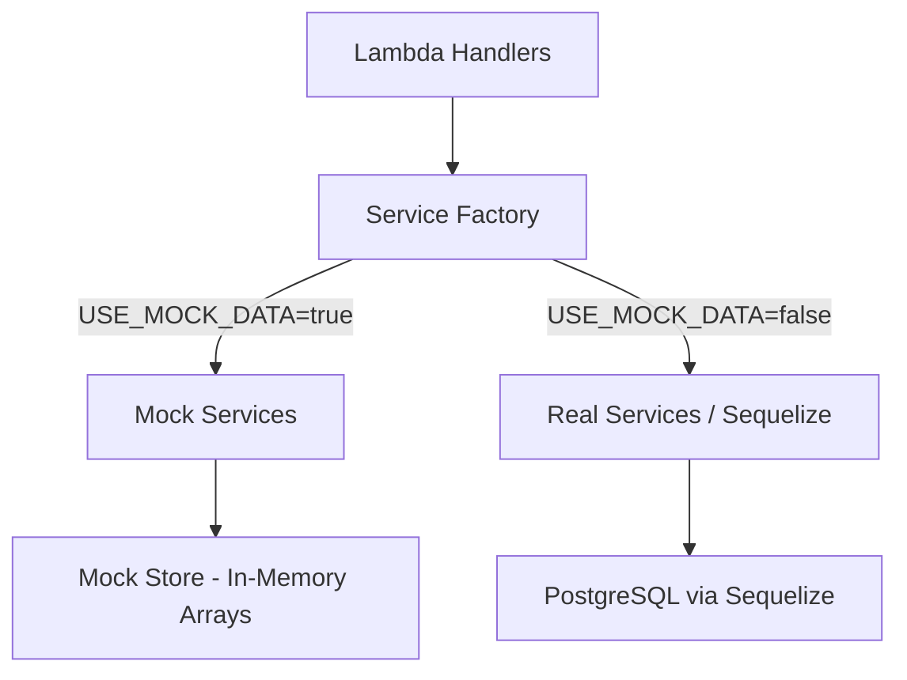

# Design Document: Mock Data CRUD

## Overview

This design introduces an in-memory mock data layer in the backend that replaces Sequelize/PostgreSQL during local development. The mock services implement the same function signatures as the real services, allowing handlers to remain unchanged. A service factory pattern controlled by the `USE_MOCK_DATA` environment variable determines which implementation is used at runtime.

## Architecture



The architecture maintains the existing handler → service → data layer pattern. The only change is introducing a factory module that resolves service implementations based on configuration.

## Components and Interfaces

### 1. Mock Store (`backend/src/mock/store.ts`)

Central in-memory data store. Holds mutable arrays for each entity type and exposes them for direct manipulation by mock services.

```typescript
interface MockStore {
  customers: MockCustomer[];
  plans: MockPlan[];
  invoices: MockInvoice[];
  payments: MockPayment[];
  mikrotikLogs: MockMikrotikLog[];
  customerStatuses: MockCustomerStatus[];
}
```

The store is initialized with seed data on module load and persists for the lifetime of the Lambda container (or serverless-offline process).

### 2. Mock Seed Data (`backend/src/mock/seedData.ts`)

Provides initial realistic data:
- 20+ customers across different statuses (active, overdue, disconnected, suspended, reconnected)
- 6 internet plans (varying speeds/prices, one inactive)
- 20+ invoices (paid, unpaid, partial, overdue)
- 20+ payments with different methods (Cash, GCash, Maya, Bank transfer)
- Related mikrotik_logs and customer_statuses entries

All IDs use valid UUID v4 format. Monetary values stored in centavos. Dates use ISO 8601 format.

### 3. Mock Services

Each mock service file mirrors the real service's exported functions:

| Mock Service File | Replaces | Key Functions |
|---|---|---|
| `mock/services/customerService.ts` | `services/customerService.ts` | createCustomer, updateCustomer, archiveCustomer, restoreCustomer, findCustomerById, listCustomers |
| `mock/services/planService.ts` | `services/planService.ts` | createPlan, updatePlan, togglePlanStatus, findPlanById, listPlans |
| `mock/services/billingService.ts` | `services/billingService.ts` | generateMonthlyInvoices, getInvoice, listInvoices, recalculateInvoiceStatus, getBillingSummary |
| `mock/services/paymentService.ts` | `services/paymentService.ts` | recordPayment, getPayment, listPayments |
| `mock/services/reportService.ts` | `services/reportService.ts` | getDashboardMetrics, getCollectionReport, getMonthlyIncomeReport, getOverdueReport |

### 4. Service Factory (`backend/src/services/index.ts`)

```typescript
const useMock = process.env.USE_MOCK_DATA === 'true';

export const customerService = useMock
  ? require('../mock/services/customerService')
  : require('./customerService');

// ... same pattern for other services
```

Handlers import from the factory instead of directly from service files.

### 5. Utility Functions in Mock Layer

Shared helpers used across mock services:

```typescript
// Pagination helper
function paginate<T>(items: T[], params: PaginationParams): PaginatedResult<T>;

// Filter helper
function matchesSearch(value: string | null, term: string): boolean;

// ID generation
function generateId(): string; // uuid v4

// Account number generation
function generateAccountNumber(existingCustomers: MockCustomer[]): string;
```

## Data Models

Mock entities mirror the Sequelize model attributes but as plain TypeScript interfaces:

```typescript
interface MockCustomer {
  id: string;
  account_number: string;
  full_name: string;
  address: string;
  mobile_number: string;
  email: string | null;
  installation_address: string;
  service_area: string;
  plan_id: string;
  installation_date: string;
  status: CustomerStatusEnum;
  created_at: string;
  updated_at: string;
  deleted_at: string | null;
}

interface MockPlan {
  id: string;
  name: string;
  speed: string;
  monthly_fee: number;       // centavos
  installation_fee: number;  // centavos
  is_active: boolean;
  created_at: string;
  updated_at: string;
  deleted_at: string | null;
}

interface MockInvoice {
  id: string;
  customer_id: string;
  plan_id: string;
  period_year: number;
  period_month: number;
  amount: number;            // centavos
  paid_amount: number;       // centavos
  status: InvoiceStatus;
  due_date: string;
  disconnected_days: number;
  created_at: string;
  updated_at: string;
  deleted_at: string | null;
}

interface MockPayment {
  id: string;
  customer_id: string;
  invoice_id: string;
  amount: number;            // centavos
  method: PaymentMethod;
  reference_number: string | null;
  receiver: string | null;
  payment_date: string;
  notes: string | null;
  recorded_by: string;
  created_at: string;
  updated_at: string;
}
```

## Correctness Properties

*A property is a characteristic or behavior that should hold true across all valid executions of a system — essentially, a formal statement about what the system should do. Properties serve as the bridge between human-readable specifications and machine-verifiable correctness guarantees.*

### Property 1: Create assigns valid ID and timestamps

*For any* entity type (customer, plan, invoice, payment) and any valid creation payload, the resulting entity SHALL have a non-empty UUID v4 `id`, and both `created_at` and `updated_at` SHALL be valid ISO 8601 timestamps set to the current time.

**Validates: Requirements 1.3**

### Property 2: Partial update preserves unmodified fields

*For any* entity and any subset of updatable fields provided in an update payload, after the update only the specified fields and `updated_at` SHALL differ from the original entity. All other fields SHALL remain unchanged.

**Validates: Requirements 1.4, 3.3**

### Property 3: Soft-delete and list exclusion

*For any* entity that is soft-deleted, the entity's `deleted_at` SHALL be set to a valid ISO 8601 timestamp, and the entity SHALL NOT appear in subsequent default list queries (queries without explicit `includeDeleted` flag).

**Validates: Requirements 1.5, 2.5**

### Property 4: Soft-delete then restore round-trip

*For any* entity that is soft-deleted and then restored, the entity's `deleted_at` SHALL be null and the entity SHALL appear in default list queries again.

**Validates: Requirements 1.6, 2.6**

### Property 5: Customer list filtering correctness

*For any* set of customers in the store and any combination of filter parameters (status, service_area, plan_id, search), all returned customers SHALL match every specified filter, and no customer matching all filters SHALL be excluded from results.

**Validates: Requirements 2.1, 2.2**

### Property 6: Customer account number format

*For any* valid customer creation payload, the generated account_number SHALL match the regex pattern `^ISP-\d{4}-\d{4}$` and the customer status SHALL be `active`.

**Validates: Requirements 2.3**

### Property 7: Associated object inclusion

*For any* customer with a valid plan_id, fetching that customer SHALL return an object containing a `plan` field with `id` matching the customer's `plan_id`. Similarly for invoices (customer + plan) and payments (customer + invoice).

**Validates: Requirements 2.4, 4.2, 5.4**

### Property 8: Invoice generation for active customers

*For any* set of active customers and a given period (year, month), after generating invoices, each active customer without a pre-existing invoice for that period SHALL have exactly one new invoice with status `unpaid` and amount equal to their plan's monthly_fee.

**Validates: Requirements 4.3**

### Property 9: Payment recording updates invoice status correctly

*For any* invoice and any sequence of payments against it, the invoice status SHALL be: `paid` if total paid_amount >= invoice amount, `partial` if 0 < total paid_amount < invoice amount, and unchanged (unpaid/overdue) if paid_amount is 0.

**Validates: Requirements 4.4, 5.2**

### Property 10: Disconnected customer reconnection on payment

*For any* customer with status `disconnected`, after a payment is recorded for that customer, the customer status SHALL be updated to `reconnected`.

**Validates: Requirements 5.3**

### Property 11: Dashboard metrics consistency

*For any* store state, the dashboard `total_active_customers` SHALL equal the count of customers with status `active`, `total_overdue_customers` SHALL equal the count with status `overdue`, and `total_disconnected_customers` SHALL equal the count with status `disconnected`.

**Validates: Requirements 6.1**

### Property 12: Collection report date range filtering

*For any* date range [from, to] and any set of payments, all payments in the collection report SHALL have `payment_date` within the specified range, and the `total_amount` SHALL equal the sum of all returned payment amounts.

**Validates: Requirements 6.2**

### Property 13: Pagination correctness

*For any* entity list and any valid page/limit parameters, the returned data length SHALL be at most `limit`, the `meta.total` SHALL equal the total matching count, and `meta.total_pages` SHALL equal `ceil(total / limit)`.

**Validates: Requirements 2.1, 3.1, 4.1, 5.1**

## Error Handling

Mock services replicate the same error patterns as real services:

| Scenario | Behavior |
|---|---|
| Entity not found (get/update/delete) | Throw `NotFoundError` with descriptive message |
| Invoice doesn't belong to customer | Throw `NotFoundError` |
| Customer not archived (restore) | Throw `NotFoundError` with "Customer is not archived" |
| Invalid pagination params | Use defaults (page=1, limit=20) |

The existing `errorHandler` middleware in handlers will catch these errors and return proper HTTP responses.

## Testing Strategy

### Property-Based Testing

- Library: **fast-check** (already compatible with vitest)
- Minimum iterations: 100 per property
- Each test tagged with: `Feature: mock-data-crud, Property N: {title}`

Property tests will generate random valid payloads and store states, then verify the properties hold. Generators will produce:
- Random customer payloads (valid names, addresses, phone numbers)
- Random plan payloads (valid names, speeds, fees in centavos)
- Random filter combinations
- Random pagination parameters within valid bounds

### Unit Tests

Unit tests complement property tests for:
- Seed data initialization (correct counts and structure)
- Specific edge cases (empty search, boundary pagination)
- Service factory switching behavior
- Error conditions (not found, invalid restore)

### Test File Structure

```
backend/src/mock/__tests__/
├── store.test.ts           # Store initialization and basic CRUD
├── customerService.test.ts # Customer mock service
├── planService.test.ts     # Plan mock service
├── billingService.test.ts  # Billing mock service
├── paymentService.test.ts  # Payment mock service
└── reportService.test.ts   # Report mock service
```
